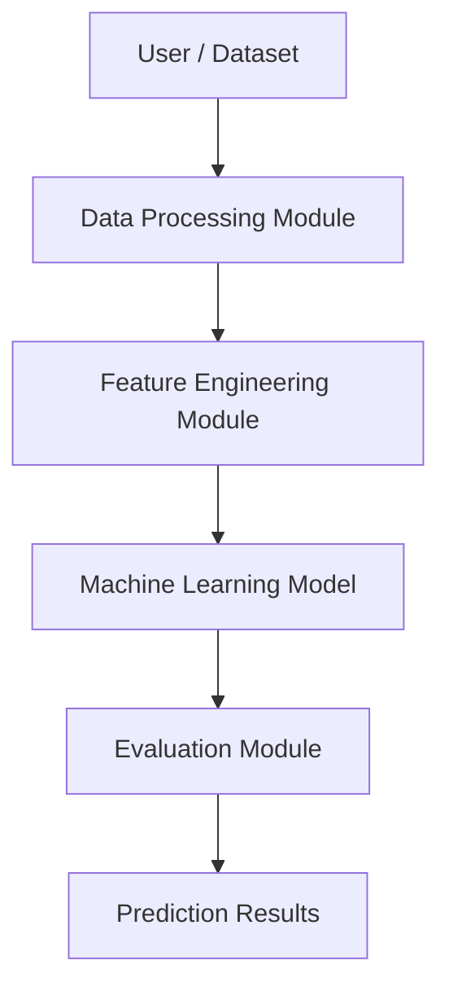
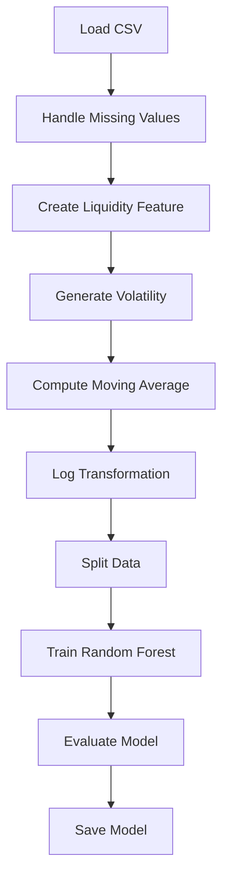
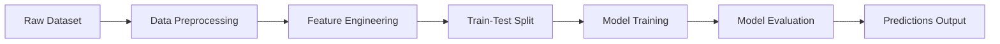

# Cryptocurrency Liquidity Prediction for Market Stability

## Overview

This project aims to predict cryptocurrency liquidity using machine learning techniques based on market data such as price, trading volume, and market capitalization.

Liquidity plays a critical role in market stability, as it determines how easily assets can be traded without significantly affecting their price. This project demonstrates how machine learning can be used to estimate liquidity and analyze market behavior.

---

## Tech Stack

* Python
* Pandas, NumPy
* Matplotlib, Seaborn
* Scikit-learn (Random Forest Regressor)
* Streamlit (optional deployment)

---

## Project Structure

```
crypto-liquidity/
│── coin_gecko_2022-03-16.csv
│── main.py
│── model.pkl
│── price_distribution.png
│── correlation_matrix.png
│── app.py (optional)
│── README.md
```

---

## Setup and Installation

1. Clone the repository

```
git clone https://github.com/Pratham07777/Cryptocurrency-Liquidity-Prediction-for-Market-Stability.git
cd Cryptocurrency-Liquidity-Prediction-for-Market-Stability
```

2. Install dependencies

```
pip install pandas numpy matplotlib seaborn scikit-learn streamlit
```

3. Run the project

```
python main.py
```

---

## Project Development Steps

### 1. Data Collection

* Dataset sourced from CoinGecko
* Contains price, 24-hour trading volume, market capitalization, and percentage changes

### 2. Data Preprocessing

* Handled missing values using forward fill
* Cleaned and validated dataset
* Selected numerical features for analysis

### 3. Exploratory Data Analysis (EDA)

* Generated statistical summaries
* Created visualizations:

  * Price distribution
  * Correlation heatmap
* Identified relationships between features

### 4. Feature Engineering

* Liquidity = 24h_volume / mkt_cap
* Volatility = percentage change in price
* Moving average (7-day window)
* Log transformation applied to volume and market cap to reduce skewness

### 5. Model Selection

* Linear Regression was initially used but performed poorly due to non-linear relationships
* Random Forest Regressor was selected for better performance on non-linear data

### 6. Model Training

* Dataset split into training (80%) and testing (20%) sets
* Model trained on engineered features

### 7. Model Evaluation

Performance metrics:

* MAE: 0.081
* RMSE: 0.419
* R² Score: 0.487

### 8. Hyperparameter Tuning

* Tuned number of estimators and tree depth
* Improved model stability and predictive performance

### 9. Model Testing and Validation

* Evaluated on unseen test data
* Compared predicted vs actual liquidity values

### 10. Local Deployment (Optional)

* Can be deployed using Streamlit or Flask
* Enables real-time liquidity prediction

---

## How the Model Works

Input Features:

* Price
* Log-transformed volume
* Log-transformed market cap
* Volatility
* Moving average

Model:

* Random Forest Regressor

Output:

* Predicted liquidity score

---

## Why Random Forest?

Random Forest was chosen because:

* It handles non-linear relationships effectively
* It is robust to outliers and noisy data
* It performs well on tabular datasets

---

## Visualizations

### Price Distribution


### Correlation Matrix


---

## Diagrams

### High-Level Design (HLD)



### Low-Level Design (LLD)



### Pipeline Architecture



---

## Outputs

* model.pkl (trained model)
* price_distribution.png
* correlation_matrix.png

---

## Limitations

* Dataset is limited and not time-series based
* Liquidity is derived, not directly measured
* Model performance is moderate (R² ≈ 0.48)

---

## Future Work

* Use time-series models (LSTM, ARIMA)
* Improve feature engineering
* Perform advanced hyperparameter tuning
* Deploy full web-based application

---

## Submission Contents

* Source code
* Dataset
* Trained model
* EDA visualizations
* HLD and LLD diagrams
* Pipeline architecture
* Final report
