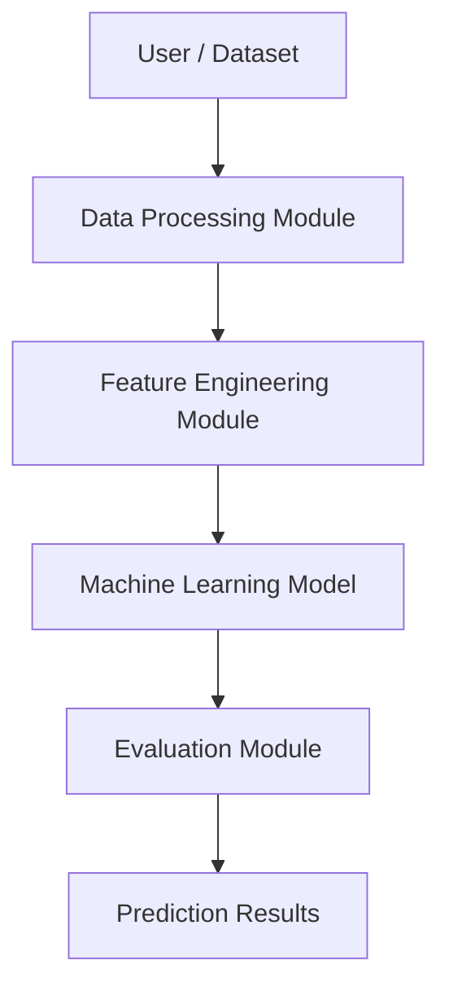
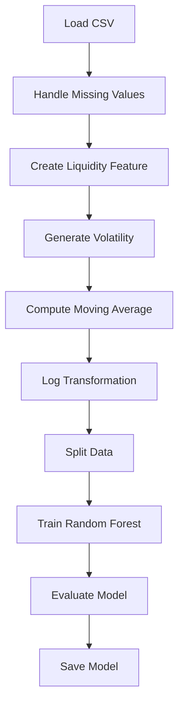

# Cryptocurrency Liquidity Prediction for Market Stability

Machine learning project to predict cryptocurrency liquidity using market data such as price, trading volume, and market capitalization.

---

## Overview

Cryptocurrency markets are highly volatile. Liquidity determines how easily assets can be traded without impacting price.
This project builds a machine learning model to estimate liquidity and analyze market stability.

---

## Tech Stack

* Python
* Pandas, NumPy
* Matplotlib, Seaborn
* Scikit-learn (Random Forest)
* Streamlit (optional)

---

## Project Structure

```
crypto-liquidity/
│── coin_gecko_2022-03-16.csv
│── main.py
│── model.pkl
│── price_distribution.png
│── correlation_matrix.png
│── app.py (optional)
│── README.md
```

---

## Setup and Installation

1. Clone the repository

```
git clone <your-repo-link>
cd crypto-liquidity
```

2. Install dependencies

```
pip install pandas numpy matplotlib seaborn scikit-learn streamlit
```

3. Run the project

```
python main.py
```

---

## Project Development Steps

### 1. Data Collection

* Historical cryptocurrency dataset (CoinGecko)
* Includes price, 24h trading volume, and market capitalization

### 2. Data Preprocessing

* Handled missing values using forward fill
* Ensured numerical consistency
* Selected numeric features for analysis

### 3. Exploratory Data Analysis (EDA)

* Statistical summaries
* Visualizations:

  * Price distribution
  * Correlation heatmap

### 4. Feature Engineering

* Liquidity = 24h_volume / mkt_cap
* Volatility = percentage change in price
* Moving average (7-day)
* Log transformations for skew reduction

### 5. Model Selection

* Linear Regression (initial, poor performance)
* Random Forest Regressor (final model)

### 6. Model Training

* Train-test split (80/20)
* Model trained on engineered features

### 7. Model Evaluation

* MAE: 0.081
* RMSE: 0.419
* R² Score: 0.487

### 8. Hyperparameter Tuning

* Tuned number of estimators and tree depth
* Improved model performance

### 9. Model Testing and Validation

* Tested on unseen data
* Compared predicted vs actual values

### 10. Local Deployment (Optional)

* Streamlit interface for prediction

---

## Diagrams

### High-Level Design (HLD)



### Low-Level Design (LLD)



### Pipeline Architecture


---

## Outputs

* model.pkl (trained model)
* price_distribution.png
* correlation_matrix.png

---

## Conclusion

The model predicts cryptocurrency liquidity with moderate accuracy (R² ≈ 0.48).
Feature engineering and non-linear modeling improved performance significantly.

---

## Future Work

* Use time-series models (LSTM)
* Improve feature selection
* Hyperparameter optimization
* Deploy full web application
